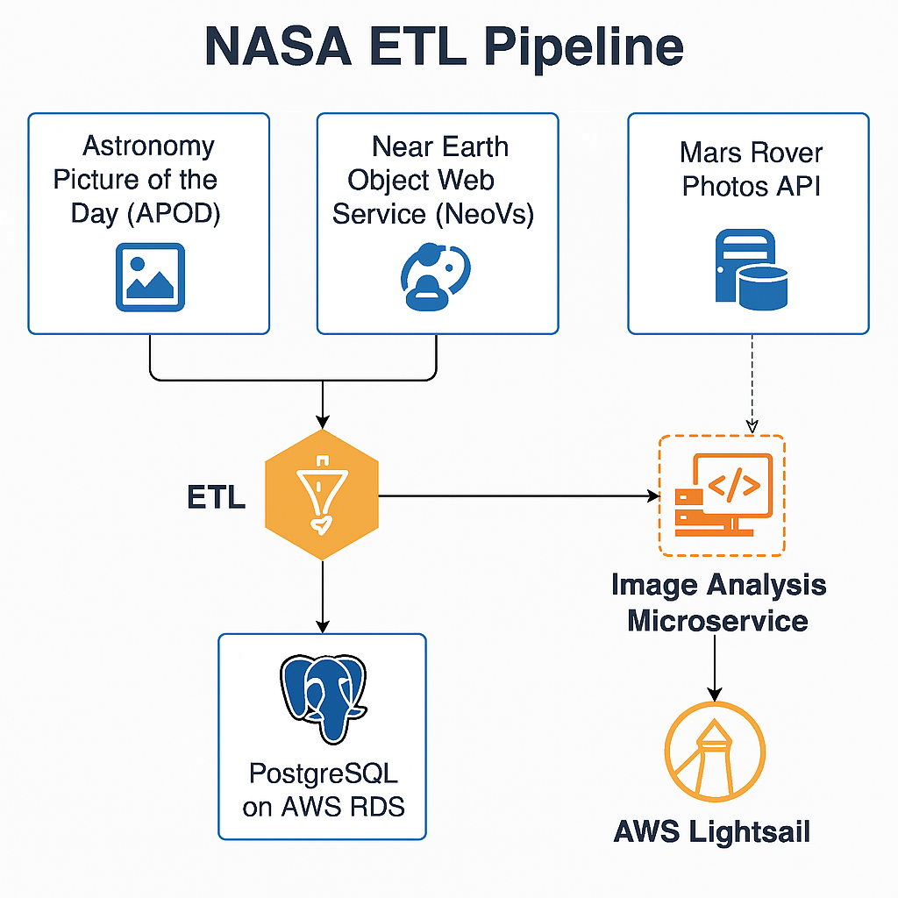

#  NASA ETL Pipeline

This project implements a complete ETL (Extract, Transform, Load) pipeline that integrates data from multiple NASA APIs, processes and enriches the data, and loads it into an AWS RDS database. The pipeline uses AWS Glue for orchestration and a FastAPI microservice hosted on AWS Lightsail for image analysis.

---

##  Architecture Diagram



---

##  Tech Stack

- **Python** (FastAPI, requests, pandas, SQLAlchemy)
- **AWS Glue** (Python Shell jobs)
- **AWS RDS** (PostgreSQL)
- **AWS Lightsail** (Ubuntu VM for FastAPI)
- **Pillow** for basic image analysis

---

## Setup Instructions

## Requirements
- Python 3.9+
- pip


### 1. Clone the Repo

```bash
git clone https://github.com/kwakuoseikwakye/nasa-etl-project.git
cd nasa-etl-project
```

### 2. Install Dependencies
```bash
pip install -r requirements.txt
```

### 3. Set up Environment Variables
Create a .env file with the following:
```bash
NASA_API_KEY=nasa-api-key
POSTGRES_HOST=
POSTGRES_PORT=
POSTGRES_DB=
POSTGRES_USER=
POSTGRES_PASSWORD=
LIGHTSAIL_SERVICE_URL=http://lightsail-ip:8000
```

### 4. AWS Setup
- Create an S3 bucket to store the ETL script
- Create a Glue Job (manual or via boto3)
- Launch a Lightsail instance for the FastAPI microservice
- Store AWS credentials and SSH key in GitHub Secrets


### Run the ETL Script Locally
```bash
python glue_etl_job.py
```

### 4. AWS Production
- Commit and push to main branch
# GitHub Actions will:
      - Upload the Glue ETL script to S3
      - Update the Glue Job with the new script
      - Deploy/restart the lightsail microservice